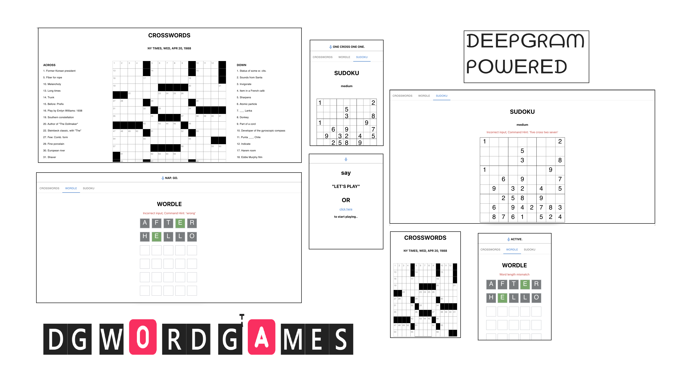

# Getting Started with DG Word Games

This project was bootstrapped with [Create React App](https://github.com/facebook/create-react-app).

## Overview

### What

This project uses [Deepgram](https://deepgram.com/)'s realtime STT transcription API to enable playing the three most popular word/number games in the world:

- Crosswords
- Wordle
- Sudoku

### How

This app is built in react.

It pre-loads in the redux store:

- a random Crosswords puzzle from [this repo](https://github.com/doshea/nyt_crosswords/)
- a wordle word from [this list](src/store/constants/wordleWords.js).
- a random dusoku puzzle from [this api](https://github.com/bertoort/sugoku)

Then, root component transcripts the user's speech in realtime and passes the transcription results to each game components. It requests for key from another [API](https://github.com/sharmavikashkr/dgwordgames-api)

#### Crosswords

The crosswords puzzle can be played by speaking out your guesses.
Eg. **"twenty five across blend"**

- It identifies the direction (**across/down**).
- It uses a [words-to-numbers](https://www.npmjs.com/package/words-to-numbers) library to convert the number in words to integers.
- It then checks if the guess word's (in this case, "blend") length is equal to the answer.
- It then set's the user guess against the relevant question.

#### Wordle

The wordle puzzle can be played by speaking out just the guess.
Eg. **"blend"**

- It will check if the guess word's (in this case, "blend") length is equal to 5.
- It will add the guess to the guesslist.

#### Sudoku

The wordle puzzle can be played by speaking out position with the guess.
Eg. **"five cross two seven"**

- It uses a [words-to-numbers](https://www.npmjs.com/package/words-to-numbers) library to convert the number in words to integers.
- It will find the position of the guess by finding row and column separated by "cross".
- It will put the guess in it's box position.

---

## Available Scripts

In the project directory, you can run:

### `npm start`

Runs the app in the development mode.\
Open [http://localhost:3000](http://localhost:3000) to view it in the browser.

The page will reload if you make edits.\
You will also see any lint errors in the console.

### `npm run build`

Builds the app for production to the `build` folder.\
It correctly bundles React in production mode and optimizes the build for the best performance.

The build is minified and the filenames include the hashes.\
Your app is ready to be deployed!

See the section about [deployment](https://facebook.github.io/create-react-app/docs/deployment) for more information.

## Deployment

This app is deployed to Azure through Github actions.
